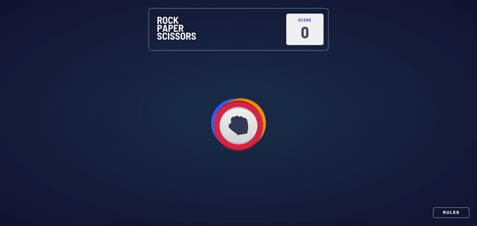

# The Odin Project - Rock, Paper, Scissors solution

This is a solution to the [Rock, Paper, Scissors Project for The Odin Project](https://www.theodinproject.com/paths/foundations/courses/foundations/lessons/revisiting-rock-paper-scissors). I got the design from [Front End Mentor.](https://www.frontendmentor.io/challenges/rock-paper-scissors-game-pTgwgvgH)


## Table of contents

- [Overview](#overview)
  - [The challenge](#the-challenge)
  - [Screenshot](#screenshot)
  - [Links](#links)
- [My process](#my-process)
  - [Built with](#built-with)
  - [What I learned](#what-i-learned)
  - [Continued development](#continued-development)
  - [Useful resources](#useful-resources)
- [Author](#author)


## Overview

### The challenge

Users should be able to:

- Play Rock, Paper, Scissors against the computer

### Screenshot




### Links

- Solution URL: [https://github.com/ItsKatato/Rock-Paper-Scissors](https://github.com/ItsKatato/Rock-Paper-Scissors)
- Live Site URL: [https://itskatato.github.io/Rock-Paper-Scissors/](https://itskatato.github.io/Rock-Paper-Scissors/)

## My process

### Built with

- HTML
- CSS
- Flexbox
- JavaScript

### What I learned

This project was a struggle. This was my first time manipulating the DOM and events and I feel like I learned so much. One thing I struggled with was selectors and I kept messing up and ended up selecting the wrong elements. I got it figured out at the end though!

I was really proud of this little code snippet:


```js
function loaded(){
    gameBtns.forEach(item => {
        item.classList.remove('loading')
    })
    bkgTri.classList.remove('loading')
}

body.onload = function() {loaded()}
```

This is so I get the transition to happen on page load!

### Continued development

I would love to work on making the animations smoother. This was my first time working with transitions so it's not as seamless as I would like it to be.

### Useful resources

- [w3schools](https://www.w3schools.com/js/default.asp) - This site helped me out so much! Especially when i came to learning about transforms and transitions

## Author

- Frontend Mentor - [@ItsKatato](https://www.frontendmentor.io/profile/ItsKatato)
- Twitter - [@RealKatato](https://twitter.com/RealKatato)
